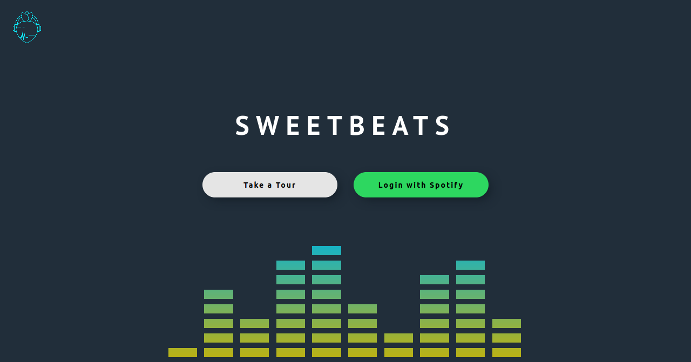

# Sweet Beats Server
**sweetbeats-backend** is the client side of a playlist creator that uses the [Spotify Web API](https://developer.spotify.com/documentation/web-api/quick-start/) and [OAuth 2.0 API](https://oauth.net/2/). The application allows the user to creator playlists based on bpm, danceability, energy, instrumentalness, and valence (musical positiveness). Users can enjoy a 30 second preview of songs in each playlist and save them to the user's Spotify account for later enjoyment. This application was created as part of [Chingu](https://chingu.io/) Voyage 19 by team Geckos 04.


<br><br><br>

## Prerequisite

* [] Clone the repository using `git clone`.

* [] Create a `.env` file within the root directory and include the below entries:

    ```REACT_APP_BACKEND_URI='http://localhost:8888'
        ```

## Available Scripts

In the root directory, you can run:

### `yarn install`

Install all dependencies necessary for the project.

### `yarn run debug`
Runs the client in the development mode on `http://locallhost:3000`.

### `yarn test`

Launches the test runner in the interactive watch mode.<br />
See the section about [running tests](https://facebook.github.io/create-react-app/docs/running-tests) for more information.

### `yarn build`

Builds the app for production to the `build` folder.<br />
It correctly bundles React in production mode and optimizes the build for the best performance.

The build is minified and the filenames include the hashes.<br />
Your app is ready to be deployed!

See the section about [deployment](https://facebook.github.io/create-react-app/docs/deployment) for more information.

## Dependencies

* [Node-Sass](https://www.npmjs.com/package/node-sass?activeTab=versions)
* [RC-Slider](https://www.npmjs.com/package/rc-slider)
* [React](https://www.npmjs.com/package/react)
* [React-Dom](https://www.npmjs.com/package/react-dom)
* [React-Loader-Spinner](https://www.npmjs.com/package/react-loader-spinner)
* [React-Modal](https://www.npmjs.com/package/react-modal)
* [React-Player](https://www.npmjs.com/package/react-player)
* [React-Router-Dom](https://www.npmjs.com/package/react-router-dom)
* [React-Scripts](https://www.npmjs.com/package/react-scripts)
* [Styled-Components](https://www.npmjs.com/package/styled-components)
* [Styled-React-Modal](https://www.npmjs.com/package/styled-react-modal)

### License
[GNU General Public License v3.0](https://www.gnu.org/licenses/gpl-3.0.en.html).